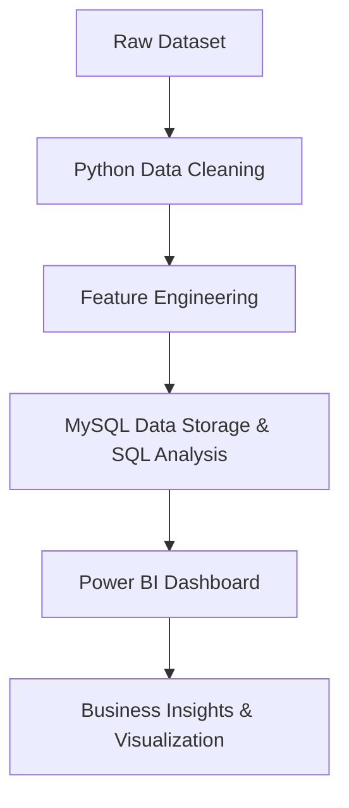

# Restaurant Business Intelligence Dashboard

An end-to-end Data Analytics and Business Intelligence project built using Python, SQL, and Power BI to analyze restaurant trends, customer preferences, pricing patterns, and business insights from the Zomato restaurant dataset.

---

# Project Overview

This project focuses on transforming raw restaurant data into actionable business insights through data cleaning, SQL-based analysis, and interactive dashboard visualization.

The workflow includes:
- Data Cleaning & Preprocessing using Python (Pandas)
- Data Storage & Querying using MySQL
- Business Intelligence Dashboard creation using Power BI
- Insight generation through analytical visualization

---

# Tech Stack

- Python
- Pandas
- NumPy
- MySQL
- Power BI
- SQL
- Jupyter Notebook

---

# Dataset Information

Dataset can be accessed here : https://www.kaggle.com/datasets/himanshupoddar/zomato-bangalore-restaurants

The dataset contains restaurant-related information such as:
- Restaurant Name
- Ratings
- Votes
- Cuisines
- Cost for Two
- Online Ordering
- Table Booking
- Restaurant Type
- Location

The raw dataset contained:
- Missing values
- Invalid ratings
- Duplicate entries
- Inconsistent formats

These issues were handled during preprocessing.

---

# Data Cleaning & Preprocessing

Performed using Python and Pandas.

## Cleaning Steps
- Removed duplicate entries
- Handled missing values
- Cleaned rating column
- Converted cost column into numeric format
- Removed unnecessary columns
- Standardized categorical values
- Created derived analytical features

## Feature Engineering
Created:
- `cost_category`
- `rating_category`

These features were later used in dashboard analysis.

---

# SQL Analysis

Data was imported into MySQL for querying and business analysis.

## Key SQL Operations
- Aggregation Queries
- Group By Analysis
- KPI Extraction
- Restaurant Trend Analysis
- Location-wise Insights
- Cost & Rating Analysis

---

# Dashboard Features

The Power BI dashboard includes:

## Executive KPIs
- Total Restaurant Listings
- Unique Restaurants
- Average Rating
- Average Cost for Two
- Total Customer Votes

## Business Insights
- Restaurant distribution by location
- Online ordering trends
- Cost vs rating analysis
- Restaurant type analysis
- Cuisine popularity analysis
- Customer engagement patterns

## Interactive Features
- Filters
- Slicers
- Dynamic visualizations

---

# Key Insights

- Mid-range restaurants dominate the market.
- Restaurants offering online ordering receive higher customer engagement.
- Certain locations have significantly higher restaurant density.
- Customer votes positively correlate with restaurant ratings.
- Casual dining restaurants attract the highest engagement.

---

# Project Workflow

